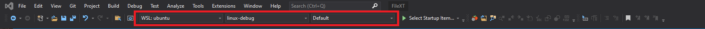
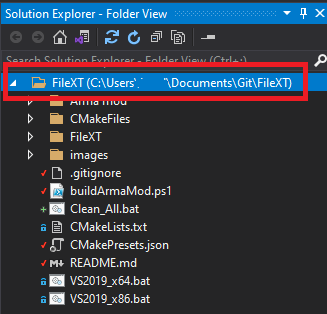

# FileXT

This is an Arma extension which lets you store and read data in files from SQF.

For usage examples, refer to the [wiki page](https://github.com/Vindicta-Team/FileXT/wiki).

You can download it from the [Steam workshop](https://steamcommunity.com/sharedfiles/filedetails/?id=2162811561).

# Compiling

Requirements:
* [CMake](https://cmake.org/) to generate project files.

## Compiling for Windows

Requirements:
* [Visual Studio 2019](https://visualstudio.microsoft.com/vs/older-downloads/) 

Run `VS2019.bat` from the project root to generate a Visual Studio 2019 solution.

## Compiling for Linux on Windows

Requirements:
* Linux development for C++ (from the Visual Studio installer)
* Windows Subsystem for Linux
    * Enable virtualization in your system bios (this differs per motherboard)
    * Enable Hyper-V in windows features. (search "Windows Features" in the start menu)
    * Install windows subsytem for linux (run `wsl --install` in an admin command prompt)
    * Reccomended: Install Ubuntu from the windows store. 
        * Alternatively you can install distributions from the wsl command as well with `wsl --install -d <distrobution name>`. Valid distribution names can be listed with `wsl.exe -l -o`
* Development tools for linux
    * Update your packages with `sudo apt update && sudo apt upgrade` (*this runs in your linux command prompt*)
    * Install the dev tools with `sudo apt install g++ gdb make ninja-build rsync zip cmake` (*this runs in your linux command prompt*)

Open the project **directory** in visual studio (ie: right click in the project root and open with visual studio). This will use CMakePresets.json to configure the generator (ninja) and target (Linux).

Next in the standard toolbar you should be able to select `WSL: <distro>` and Debug or Release (pictured below). If WSL is not present you may not have correctly satisfied the requirements section of this document, or you may have to restart Visual Studio or your computer.

You may have to select the directory in the solution explorer before those options are available:

